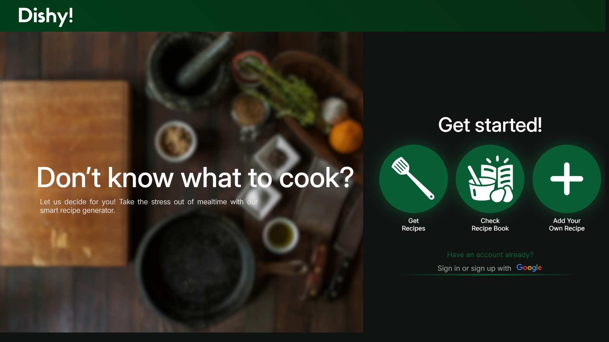
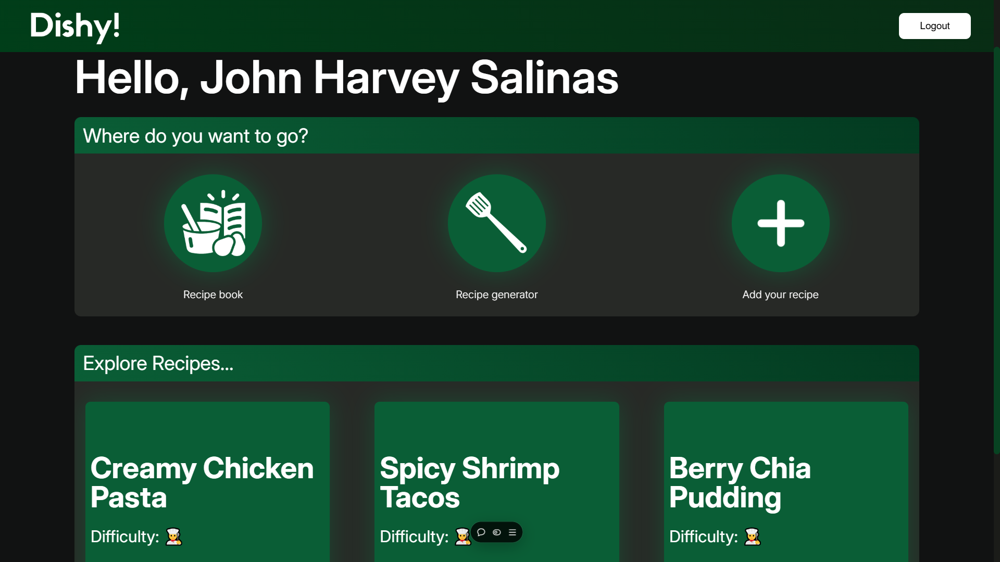
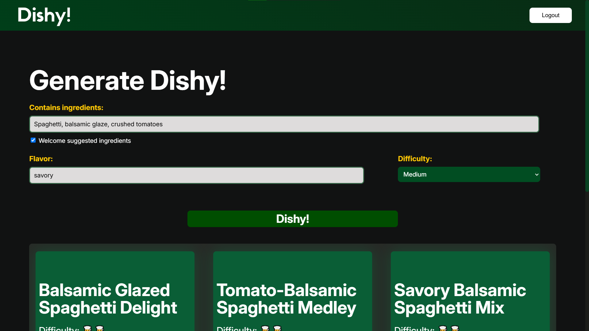
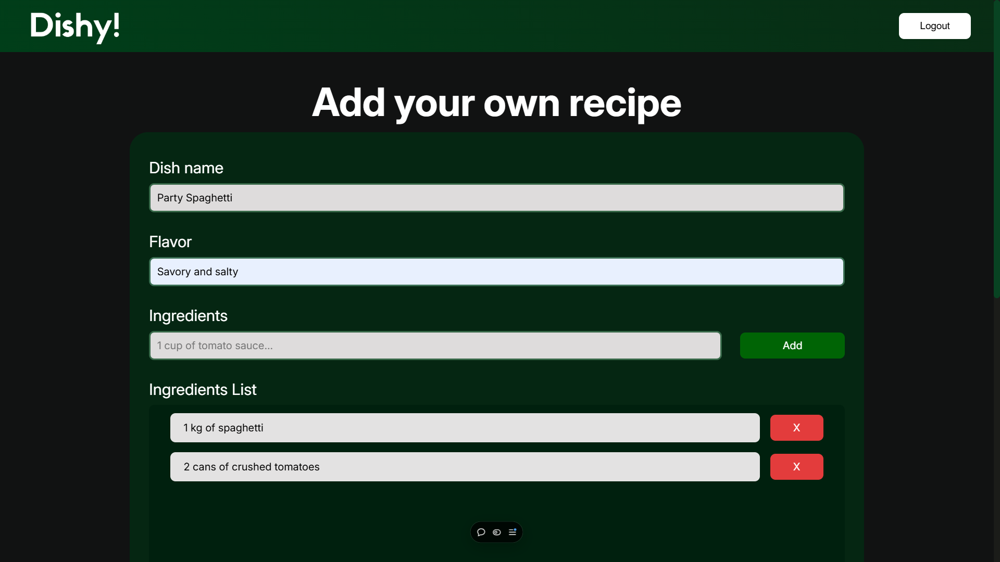

# [Dishy](https://dishycook.vercel.app/)

Dishy! is a clever culinary tool that helps you turn your pantry into a gourmet kitchen. By simply inputting the ingredients you have on hand, Dishy! generates a variety of recipe ideas tailored to your specific supplies. Dishy! takes the guesswork out of meal planning, empowering you to create delicious dishes from what you already have, reducing food waste and inspiring culinary creativity.
 

## Features

- **Find Recipes**: Discover new recipes based on the ingredients you have.
- **Add Your Own Recipes**: Easily add and save your own recipes.
- **Discover Recipes**: Explore a variety of recommended recipes.

### Find recipes: 

### Generate recipes: 

### Add your own recipes: 

## Tools and Technologies

Dishy! is made from a variety of modern web technologies and tools to provide a seamless and interactive user experience:

- **Frontend**: The frontend of Dishy! is built using HTML, CSS, JavaScript, and jQuery, providing a responsive and user-friendly interface.
- **Backend**: The backend is powered by Node.js and Express, handling API requests and managing data.
- **Database**: Firebase Firestore is used as the database to store user data and recipes securely.
- **Authentication**: Firebase Authentication is used to manage user sign-in and sign-out processes.
- **OpenAI GPT-3.5-turbo**: Dishy! uses OpenAI's GPT-3.5-turbo model to generate recipe ideas based on the ingredients provided by the user. This powerful AI model helps in creating diverse and creative recipes, enhancing the user experience.
- **Hosting**: The website is hosted on Vercel, ensuring fast and reliable access to the application.

## How It Works

1. **Input Ingredients**: Users input the ingredients they have on hand.
2. **Generate Recipes**: Dishy! uses OpenAI GPT-3.5-turbo to generate a variety of recipe ideas based on the provided ingredients.
3. **Explore and Save**: Users can explore the generated recipes, save their favorites, and even add their own recipes to the database.

## Getting Started

To get started with Dishy!, simply visit the [Dishy! website](https://dishycook.vercel.app/) and start exploring recipes. You can sign up or log in to save your favorite recipes and add your own.

## Contributing

We welcome contributions to improve Dishy!. If you have any suggestions or improvements, feel free to open an issue or submit a pull request on our [GitHub repository](https://github.com/devhrvx/Dishy/).

## Contact

For any inquiries or support, please contact me at salinas.johnharvey11@gmail.com.
